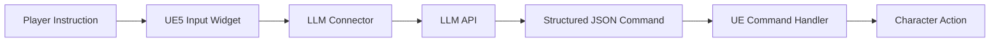

# UE5 Agent Demo

A minimal **Unreal Engine 5.5 Agent integration demo**: natural-language instructions become structured JSON commands, and Unreal command handlers execute the character actions. The model selects high-level actions; game-side execution remains deterministic.

Based on [Sovahero/UnrealAiConnector](https://github.com/Sovahero/UnrealAiConnector). This fork focuses on understanding and adapting the **Agent → structured command → game runtime** path, reusing the existing plugin, input widget, character, and movement example. The original project and plugin remain licensed under the [MIT License](LICENSE).

Current example: **“Walk forward for 3 seconds”** → `move` / `character` / `["forward#3"]` → character movement. Compilation, LLM requests, and movement have **not yet been verified on this machine**.



## What this demo shows

- UE5 / Blueprint and C++ integration
- HTTP-based LLM interaction
- Structured Agent commands guided by registered command descriptions
- Command dispatch through Unreal handlers
- Deterministic game-side action execution

[Interview notes](docs/INTERVIEW_DEMO.md) explain the integration and this fork's changes.

## Phase 1 setup (Windows)

Requires Unreal Engine **5.5**, Visual Studio 2022 with C++ game development tools, and the Windows SDK required by UE 5.5. The project already contains the patched plugin at `AiTestProject/Plugins/LLMConnector`; no plugin copy or asset editing is needed. The top-level plugin source is patched too. The credential-bearing upstream prebuilt DLL has been removed, so build the plugin locally:

```powershell
# Run from the repository root. Select your existing UE 5.5 installation folder.
$ueRoot = Read-Host 'UE 5.5 installation folder'
$plugin = (Resolve-Path '.\AiTestProject\Plugins\LLMConnector\LLMConnector.uplugin').Path
$package = Join-Path (Get-Location) 'AiTestProject\Saved\LLMConnectorBuild'
& "$ueRoot\Engine\Build\BatchFiles\RunUAT.bat" BuildPlugin "-Plugin=$plugin" "-Package=$package" -TargetPlatforms=Win64
# Continue only if the build succeeds.
Copy-Item "$package\Binaries" '.\AiTestProject\Plugins\LLMConnector\' -Recurse -Force
```

Supply your own API key **only in this PowerShell process**, then launch the Editor from the same shell so it inherits the key:

```powershell
$env:UE_AGENT_API_KEY = Read-Host 'OpenRouter API key'
& "$ueRoot\Engine\Binaries\Win64\UnrealEditor.exe" (Resolve-Path '.\AiTestProject\AiTestProject.uproject').Path
```

The key is transient and is never saved by plugin settings. Do not put it in source, `.ini` files, or shell command literals. Close this shell when finished. Upstream Git history is preserved and still contains its original credential; do not use that credential.

1. In **Edit → Project Settings → Plugins → LLM Connector**, keep the OpenRouter API URL and set **ModelName** to an available model supporting `response_format: json_object`.
2. Open **Content → TopDown → Maps → TopDownMap** if it is not already open.
3. Click **Play**, enter **Walk forward for 3 seconds** in the existing input widget, and click its send button.
4. Check the response/command display and movement. **Window → Developer Tools → Output Log** contains connector diagnostics.

Generated build files are ignored. UE compilation, API access, and character movement require the local smoke test above; they have not been verified on this machine. No new commands, UI, maps, or characters are added.

---
<br>

## AI Connector for Unreal Engine 5

### Overview
LLM Connector is a plugin that integrates Large Language Models into Unreal Engine projects. It enables connection between your game and AI models through API services such as OpenRouter and others.

The plugin provides a framework for sending user requests to LLM via HTTP and processing returned responses using JSON.


## Core Concepts

### Architecture

The plugin follows a simple flow:

1. The user sends a message to the LLM through HTTP
2. The plugin processes the response through JSON and returns a structure
3. The response is displayed to the player
4. The response structure is directed to command handlers
5. Command handlers execute game logic

```json
The LLM response comes in JSON format with the following structure:
{
  "command": "command_name",
  "target": "command_target",
  "parameters": ["parameter1", "parameter2"],
  "message": "Text message for the user"
}
```
<br>

### Command System

Commands are the primary way LLMs interact with your game:

- Each command has a name, target, and parameters
- Commands are processed by specialized handlers
- Handlers determine which game objects or systems respond to specific commands
- The system is extensible through both C++ and Blueprint

### `AiTestProject`
The repository includes a UE5.5 Blueprint test project that demonstrates a simple example of how AI controls a Character based on your instructions.

## Setup

### Plugin Installation

1. Copy `LLMConnector` to your project's `Plugins` directory (create it if it doesn't exist)
<br>

2. Enable the plugin in `Edit` > `Plugins`
<br>

3. Restart the editor

### OpenRouter Setup

To use the plugin:

1. Create an account on [OpenRouter](https://openrouter.ai)<br>
2. Generate an API key
<br>

3. It's recommended to add funds to your account, for example $5, but you can also choose free models
4. In `Models`, select a compatible AI - Claude, GPT, etc. (Google: Gemini 2.0 Flash is set by default)
<br>

5. Go to `Project Settings` > `Plugins` > `LLMSettings`
6. Set `ModelName` here; supply `UE_AGENT_API_KEY` through the process environment as described above
<br>

## Blueprint Quick Start

### Sending Messages

Function for sending a message and receiving a response
<br>

### System Messages

To ensure the AI understands its role during the dialogue, it's recommended to add the main game context in the first messages and reserve them from deletion
<br>

### Creating Command Handlers

To separate logic and avoid writing everything in one place, it's recommended to use the command handler system. These handlers will intercept the response from the AI and execute the necessary logic
1. Create a Blueprint inherited from LLMCommandHandlerBase
<br>
or an ActorComponent inherited from LLMCommandComponent
<br>


3. Override the `CanExecuteCommand` and `ExecuteCommand` functions
<br>

4. Configure the command handler parameters and register it with LLMConnector
<br>
For ActorComponent, attach it to an Actor and set the flag
<br>


## C++ Quick Start

### Initialization
```cpp
ULLMConnectorSubsystem* LLMConnector = ULLMConnectorSubsystem::GetLLMConnector(this);
if(LLMConnector)
{
  LLMConnector->OnResponseReceived.AddUniqueDynamic(this, &ThisClass::OnReceived);
  LLMConnector->OnError.AddUniqueDynamic(this, &ThisClass::OnError);
}
```
### Sending Messages
```cpp
// Send a message to the LLM
ULLMConnectorSubsystem* LLMConnector = ULLMConnectorSubsystem::GetLLMConnector(this);
if (LLMConnector && LLMConnector->CanSendLLMPrompt())
{
  LLMConnector->SendLLMPrompt(TEXT("Move the character left for 5 seconds"), ELLMRole::User);
}
```

### System Messages
```cpp
// Send only if history is empty
if(m_LLMConnector == nullptr || m_LLMConnector->GetPromptHistory().Num() > 0)
{
  return false;
}

// Creating a root context map
m_LLMConnector->AddPromptHistory(FLLMPromptBase(ELLMRole::System, TEXT("You are an AI assistant in a game world.")));
m_LLMConnector->AddPromptHistory(FLLMPromptBase(ELLMRole::System, m_LLMConnector->GetContextCommands()));
m_LLMConnector->SetCountReservedMessages(m_LLMConnector->GetPromptHistory().Num());
```

### Creating a Command Handler

```cpp
// MyCommandHandler.h
#pragma once

#include "CoreMinimal.h"
#include "LLMCommandHandler.h"

#include "LLMItemCommandBase.generated.h"

/**
 * Your CommandHandler
 */
UCLASS()
class UMyCommandHandler : public ULLMCommandHandlerBase
{
  GENERATED_BODY()
public:
  virtual bool CanExecuteCommand(const FLLMResponseBase& ResponseParams) override
  {
    if(GetParams().Name.ToLower() != ResponseParams.Command.ToLower())
    {
      return false;
    }
    return ResponseParams.Parameters.Num() > 0;
  }
  virtual FString ExecuteCommand(const FLLMResponseBase& ResponseParams) override
  {
    // Based on the LLM response, perform actions using values from these fields
    ResponseParams.Parameters
    ResponseParams.Target

    // Return a response to LLM if you want to get another answer (Useful for game database interaction commands)
    return TEXT("Requested data");

    // Or specify an empty string if it's sufficient to just execute this command
    return TEXT("");
  }
};
```

### Registering Command Handlers

```cpp
ULLMCommandHandlerBase* NewHandler = NewObject<UMyCommandHandler>(this);

FLLMCommandStruct Params;
Params.Name = TEXT("move");
Params.Description = TEXT("Command to move the character in specified direction for a certain amount of time");
Params.Target = TEXT("character");
Params.Examples = { TEXT("{command: 'move', target: 'character', parameters: ['forward#4'], message: 'Going forward 4 seconds.'}") };
NewHandler->InitWithParams(Params);

m_LLMConnector->RegisterCommandHandler(NewHandler);
```

### Context Description Structures
For convenient description of the game world and parameters, use the `FLLMPromptNode` and `FContextDescription` structures
```cpp
// Helps create internal nesting for storing and sending text

// In your Blueprint Manager
UPROPERTY(EditAnywhere, BlueprintReadWrite, Category = "Parameters Context Description")
TMap<EGameLevelType, FContextDescription> GameLevelContextDesc;
...
FLLMPromptNode RootNode;
RootNode.ContentText = TEXT("Description of game types");
FContextDescription::ConvertContextMapToNode(GameLevelContextDesc, RootNode);

FString GameLevelContext = RootNode.ToString();
```

## Implementation Considerations

- Communication with LLMs over HTTP is similar to a ping-pong game with delays from 1 second. Currently, it's not possible to receive responses on-the-fly
- When possible, use paid models; free models are not as intelligent and have message quotas
- Some models cannot produce responses in JSON format, for example, DeepSeek
- Each message consumes tokens. The more tokens used, the more expensive the request. On average, 1 English character uses ~0.25 tokens (4 characters = 1 token), and characters of other languages may use up to ~0.3 tokens (approximately 3 characters of another language = 1 token). It's recommended to describe the game context in English to optimize costs, while user communication can be conducted in any language
- When you send a message each time, the entire history of previous messages is also sent; by default, there's a limit of 20 messages, after which the oldest messages will be deleted
- Break down your game context into message history; this helps the LLM understand better
- Provide clear instructions in system prompts about available commands
- Include examples of proper command formatting
- Store API keys in a secure place and don't disclose them
